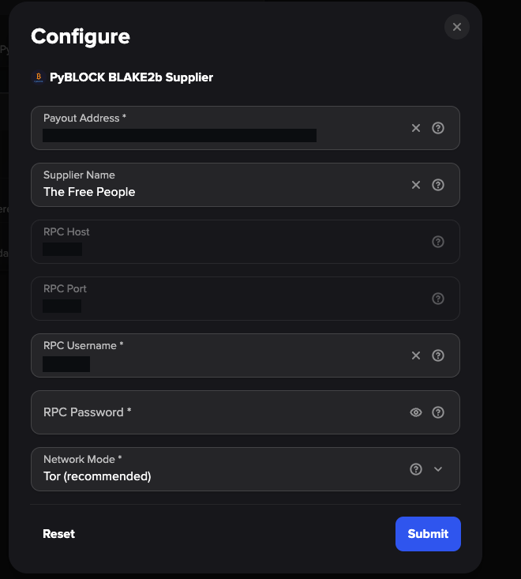

# PyBLOCK BLAKE2b Supplier — StartOS Package

[](https://github.com/iFadi/pyblock-blake2b-supplier/actions/workflows/ci.yml)
[](LICENSE)

Publishes BLAKE2b block templates from a local Bitcoin Knots node to the
[PyBLOCK Carousel](https://b.pyblock.xyz:8443/suppliers.php) mining pool.
Packaged for StartOS 0.4 using the TypeScript Package API.

---

## Overview

This package connects to the local `bitcoind` dependency on your StartOS
device, calls `getblocktemplate` with the `segwit` and `blake2b` rules, and
submits the resulting template to PyBLOCK every ≤20 seconds and immediately
on every new block.

**Outbound-only.** No inbound ports are opened. Your private keys, wallet
seed, and RPC credentials never leave the device.

**Tor by default.** Templates are published through the package's own Tor
daemon to PyBLOCK's onion service. Clearnet is an opt-in alternative; the
service fails rather than silently downgrading when Tor is selected but
unavailable.

---

## Features

- Polls block height every 2 s; publishes on height change or ≥20 s interval
- GBT rules: `segwit` + `blake2b` (required for BLAKE2b Carousel eligibility)
- Tor-first transport: routes to PyBLOCK's `.onion` via an in-container Tor daemon
- Clearnet fallback available as explicit opt-in
- Eight distinct health states reported to StartOS
- Payout address validated locally against the PyBLOCK address regex
- RPC credentials stored in the package's persistent volume; never written to logs
- Zero inbound surface: no listening ports, no ControlPort on the Tor daemon

---

## Requirements

- StartOS 0.4 server
- `bitcoind` (Bitcoin Knots ≥ 29.4.1 with BLAKE2b support) installed and
  running on the same server — required dependency; remote nodes are not supported
- `datacarrier=0` in your node's `bitcoin.conf` (PyBLOCK rejects templates
  containing OP_RETURN outputs)
- A BLAKE2b-chain payout address and dedicated RPC credentials for this supplier

---

## Installation

Build or obtain the `.s9pk` package and install it through your StartOS
side-loading workflow. The package is not currently distributed through the
StartOS marketplace.

After installation, StartOS creates a critical **Configure PyBLOCK BLAKE2b
Supplier** task. Open that task and fill in your payout address, RPC
credentials, and transport preference before starting the service.

See [`instructions.md`](instructions.md) for the full first-run walkthrough
and health-state reference.

---

## Architecture

```
StartOS device
│
├── Bitcoin Knots BLAKE2b node  (separate StartOS package: bitcoind)
│   └── JSON-RPC on port 8332 (internal, never forwarded)
│
└── pyblock-blake2b-supplier  (this package)
    ├── supplier/main.py          — main event loop
    ├── supplier/bitcoin_rpc.py   — JSON-RPC client (direct, no proxy)
    ├── supplier/pyblock.py       — HTTP POST publisher (via Tor SOCKS5)
    ├── supplier/config.py        — config loader + validator
    ├── supplier/health.py        — state machine → /root/start9/health.json
    ├── supplier/tor.py           — Tor readiness probe and SOCKS helpers
    ├── scripts/docker_entrypoint.sh  — starts Tor daemon, then Python loop
    └── startos/                  — StartOS TypeScript Package API
        ├── manifest/index.ts     — package manifest
        ├── main.ts               — daemon + health check wiring
        ├── backups.ts            — volume backup/restore
        ├── dependencies.ts       — bitcoind dependency declaration
        ├── actions/config.ts     — Configure action (payout address, RPC, transport)
        ├── init/index.ts         — lifecycle hooks + first-run setup task
        └── versions/current.ts  — version + release notes
```

### Loop invariant

| Parameter | Value |
|---|---|
| Poll interval | 2 s |
| Max publish interval | 20 s |
| GBT rules | `segwit`, `blake2b` |

### Transport endpoints

| Mode | Endpoint |
|---|---|
| Tor (default) | `http://qzhxvlnzfir7pwmsheadahe6hejqkvb3z5nn35ils32hptgpwuzabhyd.onion/` |
| Clearnet | `http://pool.pyblock.xyz:5800/` |

### Headers sent to PyBLOCK

| Header | Value |
|---|---|
| `X-PyBLOCK-UA` | Node `subversion` string from `getnetworkinfo` |
| `X-PyBLOCK-User` | Payout address |
| `X-PyBLOCK-Name` | Supplier name (omitted if not configured) |
| `Content-Encoding` | `gzip` when compression reduces payload size |

---

## Health states

| State | StartOS result | Meaning |
|---|---|---|
| `healthy_active` | Success | PyBLOCK accepted your most recent template |
| `node_unsynced` | Loading | Node is in initial block download |
| `starting` | Starting | Supplier has started; first publish not yet sent |
| `node_unavailable` | Failure | RPC unreachable or credentials rejected |
| `gbt_unsupported` | Failure | Node rejected the `blake2b` GBT rule |
| `tor_unavailable` | Failure | Tor selected but circuit could not be built |
| `pyblock_rejected` | Failure | PyBLOCK rejected the template (often: OP_RETURN in mempool) |
| `config_error` | Failure | Missing or invalid configuration value |

The health check fails closed: it reports success only when the recorded
state is fresh (≤60 s) and the supplier process is still alive.

---

## Build

### Prerequisites

```sh
# Node.js ≥ 20 + npm
node --version
npm --version

# start-cli (for packaging .s9pk files)
curl -fsSL https://start9.com/start-cli/install.sh | sh

# squashfs-tools (packaging dependency)
sudo apt install -y squashfs-tools squashfs-tools-ng jq

# Docker (for running unit tests via the Dockerfile test stage)
docker --version
```

### Install SDK dependencies

```sh
npm ci
```

### TypeScript type check

```sh
npm run check
```

### TypeScript security tests

```sh
npm test
```

Covers first-save password rejection, exact retention, exact rotation, and
non-disclosure through logs and Configure form defaults.

### Unit tests (via Docker build stage)

```sh
docker build --target test -t pyblock-blake2b-supplier-test .
```

Runs the full Python test suite inside the Docker `test` stage. No containers
remain running after the build completes.

### Unit tests (direct, no Docker)

If Python 3.12+ and the required packages are available locally:

```sh
python3 -m pytest tests/ -v
```

Dependencies: `pyyaml`, `PySocks`, `pytest`.

### Bundle TypeScript (no .s9pk output)

```sh
npm run build
```

Produces `javascript/index.js` — the bundled StartOS ABI used during packaging.

### Build .s9pk package (requires start-cli)

```sh
make x86        # x86_64 only
make arm        # aarch64 only
make arches     # both architectures
```

Outputs: `pyblock-blake2b-supplier_x86_64.s9pk` or `_aarch64.s9pk`.

### GitHub package builds

Pull requests, pushes to `main`, and manually dispatched Package workflow runs
build both `.s9pk` variants with StartOS's official reusable build workflow at
a fixed upstream commit. No `DEV_KEY` is passed to that workflow: it generates
an ephemeral signing key, and its temporary GitHub Actions artifacts are only
for verification and testing, not distribution. This is a deliberately narrow
trust boundary. The caller is commit-pinned, but the upstream workflow still
invokes mutable helper-action references, so ordinary Package builds do not
have a fully immutable transitive action graph.

Version tags matching `v<major>.<minor>.<patch>-rev<revision>` publish signed
`.s9pk` files as assets on an initial GitHub **prerelease**. The local Release
workflow validates the tag against the package ExVer in
`startos/versions/current.ts` (`v1.0.0-rev8` maps to `1.0.0:8`), builds x86_64
and aarch64 packages, verifies their manifests, and publishes `SHA256SUMS`
alongside release notes sourced from the manifest. It reproduces the pinned
official Start9 workflow's QEMU, Docker, Buildx, and containerd image-store
prerequisites, uses only immutable action SHAs, and checksum-verifies the exact
StartOS `start-cli` v2.0.0 binaries before use. No StartOS registry or S3
publication is configured. See
[CONTRIBUTING.md](CONTRIBUTING.md#maintainer-release-runbook) for the maintainer
runbook.

The Release workflow can also be manually dispatched as a non-publishing dry
run. That path validates a tag-shaped input against the checked-out manifest,
generates a fresh ephemeral key per architecture, executes the same packaging
steps, and uploads one-day verification artifacts. It cannot receive `DEV_KEY`
and the release job is disabled for manual dispatches.

Only the tag-triggered Release workflow's isolated key-provisioning step uses
the persistent repository `DEV_KEY`; its signed GitHub Release assets are the
distributable release artifacts. Configure `DEV_KEY` as a GitHub Actions
repository secret and never commit it, paste it into workflow files, or expose
it in logs. The immutable `v1.0.0-rev6` and `v1.0.0-rev7` tags remain honest
records of failed pre-release attempts; neither published a GitHub Release or
package. Changing this repository's visibility is a separate manual
administrative decision and is not part of the packaging or release workflows.

---

## Configuration

The service reads its runtime config from `/root/start9/config.yaml` (written by
the StartOS Configure action). The operator must supply:

| Field | Required | Description |
|---|---|---|
| Payout Address | Yes | BLAKE2b-chain address for coinbase splits |
| RPC Username | Yes | `rpcuser` from your Bitcoin Knots node |
| RPC Password | First save | `rpcpassword` from your node; later, leave blank to retain it or enter a new value to rotate it |
| Supplier Name | No | Public display name on PyBLOCK's suppliers page |
| Network Mode | Yes | `tor` (recommended) or `clearnet` |

RPC host and port are resolved automatically from the local `bitcoind`
dependency on every start and are shown read-only in the Configure form.
The masked RPC password is never prefilled or returned to the browser. A blank
field on a later save retains the exact stored value; the first save requires a
password, and any later nonblank value replaces it without transformation.

---

## Security

- **No inbound ports.** The service opens zero listening sockets.
- **Credential isolation.** The RPC password is stored in the package's
  persistent volume and is never written to logs or error messages. Storage
  encryption depends on the operator's StartOS host configuration.
- **Minimal disclosure to PyBLOCK.** The pool receives only: the block template
  JSON, the payout address, the optional supplier name, and the node user-agent
  string.
- **Tor-or-fail.** When Tor is selected, the service proves a live circuit to the
  publish target before entering the main loop. It never silently falls back to
  clearnet.
- **Payout address validation.** The address is validated locally against the
  PyBLOCK pattern before use.
- **Tor daemon hardened.** `SocksPolicy` restricts the proxy to loopback only;
  no `ControlPort` is opened.

See [SECURITY.md](SECURITY.md) for the vulnerability reporting process.

---

## Screenshots



This genuine StartOS Configure capture uses opaque redactions for the payout
address, RPC endpoint, and RPC username. The saved RPC password is never
returned to the form. On later edits, leave the password field blank to keep
the stored value or enter a new value to rotate it.

See [`docs/screenshots/CAPTURE.md`](docs/screenshots/CAPTURE.md) for the capture
and redaction checklist. Generated or mockup screenshots are not accepted.

---

## Payout terms disclaimer

PyBLOCK's documented split for the Carousel is 96% miner · 3% supplier · 1%
PyBLOCK. These are pool-operator terms; this package does not hard-code or
guarantee any percentage. Verify current terms at
https://b.pyblock.xyz:8443/suppliers.php before relying on them.

---

## License

[MIT](LICENSE) — Copyright © 2026 Fadi Asbih

---

## Donate

Support the project at [donate.asbih.com](https://donate.asbih.com/).

---

## Contributing

See [CONTRIBUTING.md](CONTRIBUTING.md).
